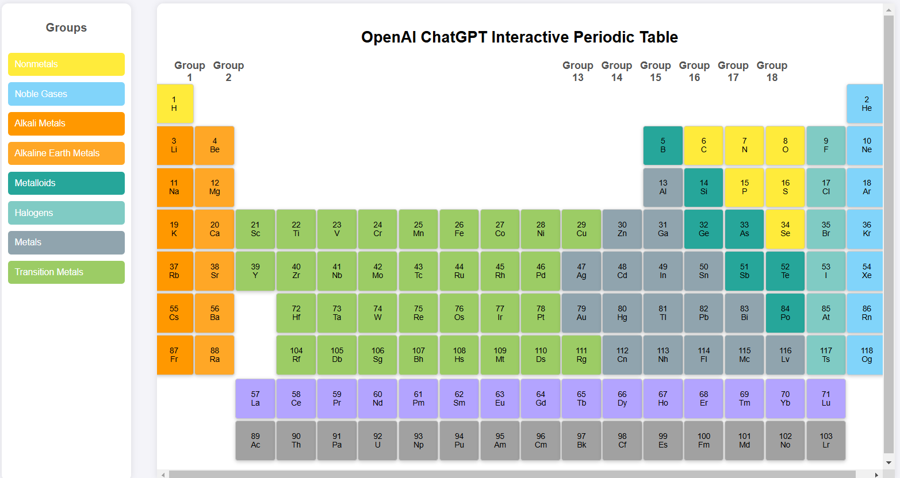
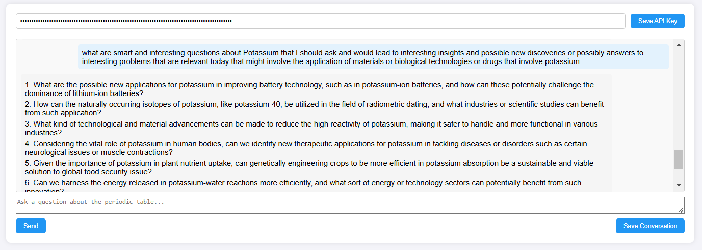
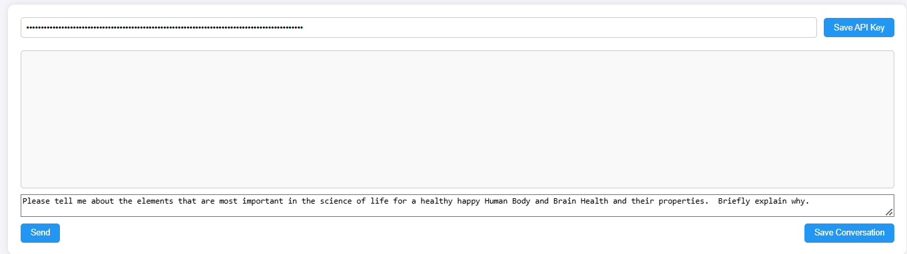

# Welcome to Interactive Periodic Table with OpenAI's ChatGPT Integration


*A dynamic, user-friendly, and educational tool for exploring chemistry and AI capabilities.*

---

## **Overview**
Hello Everyone,  This exciting project combines a beautiful **Interactive Periodic Table** with **OpenAI's GPT-4 capabilities** to provide a rich learning experience for students, educators, and developers. It is designed for:

- **Chemistry enthusiasts**: Explore element details interactively.
- **AI enthusiasts**: Experiment with OpenAI's capabilities through a chat feature.
- **Developers**: Extend and integrate this project into your own tools or curricula.

---

## **Features**
1. **Periodic Table**:
   - Displays elements categorized by their properties (e.g., metals, nonmetals, noble gases).
   - Interactive elements with on-hover scaling and detailed popups.
   - Includes group-level descriptions and links to Wikipedia for further learning.

2. **ChatGPT Integration**:
   - Enables users to ask chemistry-related questions or general queries.
   - Powered by **OpenAI GPT-4** API.
   - Save chat conversations as text files for future reference.

3. **User-Friendly Design**:
   - Clean and responsive layout.
   - Intuitive navigation for users of all ages.

4. **API Key Support**:
   - Users can input their OpenAI API keys to personalize the experience.

---

## **Getting Started**

### **Prerequisites**
- **Basic Setup**: A modern web browser.
- **Optional**: A valid OpenAI API key (for GPT-4 integration).

---

### **Local Deployment**
To run the app locally:
1. Clone the repository:
   ```bash
   git clone https://github.com/your-repo/interactive-periodic-table.git
   cd interactive-periodic-table
   ```
2. Open the `index.html` file in your browser:
   - On most systems, you can double-click the file.
   - Alternatively, serve it locally using a simple HTTP server:
     ```bash
     python3 -m http.server 8000
     ```
3. Open your browser and navigate to `http://localhost:8000`.

---

### **Live Deployment Options**

#### **Option 1: Streamlit**
This method involves deploying on Streamlit for a simple, free, and Python-compatible solution. See the detailed steps in the [Streamlit Deployment Guide](#streamlit-deployment-guide).

#### **Option 2: Google Cloud Run**
For a scalable, production-ready deployment:
1. Containerize the application using Docker.
2. Deploy to Google Cloud Run. Full instructions in the [Google Cloud Run Guide](#google-cloud-run-guide).

---

## **Usage**

### **Exploring the Periodic Table**
- Click on an element to view its atomic number, symbol, and additional details.
- Use the **Legend Panel** to filter groups like alkali metals or halogens.
- Learn more about each element via Wikipedia links.

### **Chat with OpenAI APIs using GPT-4**
1. Input your OpenAI API key in the designated field.
2. You can Ask questions about chemistry or other topics.
3. You can Save your chat conversations using the **Save Conversation** button.

---

## **Customization and Development**
Developers can extend or customize the application by:
1. **Modifying Styles**:
   - Edit `style` blocks within `index.html` or add your own CSS file for design changes.
2. **Extending Functionality**:
   - Add new AI models or APIs by modifying the `sendMessage()` function in the script.
3. **Adding Elements**:
   - Update the `elements` array in the script to add or modify periodic table entries.

---

## **Known Issues**
- **No API Key**: The chat feature requires a valid OpenAI API key. You can obtain this from your OpenAI account. Users without one will be limited to the periodic table functionality.
- **Mobile Experience**: While functional, the layout is optimized for desktop browsers.  Use Control + and Control - Keys to change Zoom for your browser page.

---

## Sample OpenAI ChatGPT Interactive Periodic Table App Screenshots:


*A dynamic, user-friendly, and educational tool for exploring chemistry and AI capabilities.*

*An interactive chemistry assistant for exploring chemistry and AI capabilities.*

*A sample question and response from OpenAI ChatGPT4 interactive chemistry assistant for exploring chemistry and AI capabilities.*

*A sample question and response from OpenAI ChatGPT4 interactive chemistry assistant for exploring chemistry and AI capabilities.*

*A sample question and response from OpenAI ChatGPT4 interactive chemistry assistant for exploring chemistry and AI capabilities.*

*A sample question and response from OpenAI ChatGPT4 interactive chemistry assistant for exploring chemistry and AI capabilities.*


## Please see chat-history.txt in this repository for a sample of the OpenAI ChatBot using ChatGPT4 dialog and conversation

[!(chat-history.txt)](https://github.com/lhiebert01/interactive-periodic-table/blob/main/chat-history.txt)


## **Contributing**
Contributions are welcome!  
- Fork the repository and create a new branch:
  ```bash
  git checkout -b feature-branch-name
  ```
- Submit a pull request explaining your changes.

---

## **Acknowledgments**
- **OpenAI GPT-4**: For the AI-powered chat feature.
- **Periodic Table Design**: Designed by Lindsay Hiebert, to inspire educational tools for chemistry learning.

---

## **License**
This project is licensed under the [MIT License](LICENSE).

---

## **For Blog/Article Inclusion**

### **Why This App?**
The interactive periodic table app bridges **education** and **innovation**. It simplifies chemistry learning while showcasing the capabilities of **AI-driven applications**. With a seamless user experience and options for both local and cloud deployment, the app empowers users to learn and innovate.

- **Educators**: Use it in classrooms to explain periodic trends and properties.
- **Students**: Deepen understanding by querying AI for chemistry insights.
- **Developers**: Extend it into personalized learning platforms or advanced scientific tools.

**Ready to start? Clone the repo and begin experimenting today!**  

Link to repository: [GitHub Repository](https://github.com/your-repo/interactive-periodic-table)

---

Let me know if you'd like specific sections revised or added!  

Thank You.  Lindsay Hiebert
